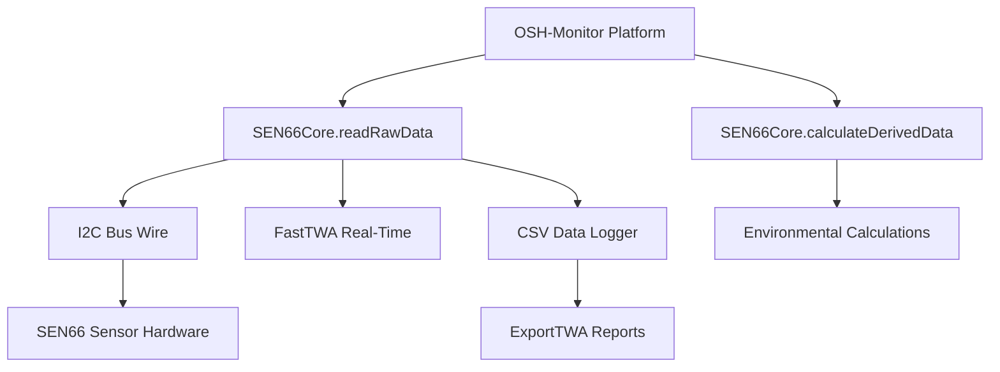

# SEN66Core Library - Developer Guide

**Hardware Abstraction Layer for Sensirion SEN66 Environmental Sensor**

This guide explains the SEN66Core library for new engineers joining the OSH-Monitor environmental monitoring project.

---

## Table of Contents

- [What is SEN66Core and Why Do We Need It?](#what-is-sen66core-and-why-do-we-need-it)
- [Hardware Abstraction Architecture](#hardware-abstraction-architecture)
- [Key Design Patterns](#key-design-patterns)
- [Integration with OSH-Monitor](#integration-with-osh-monitor)
- [Critical Implementation Details](#critical-implementation-details)
- [Common Pitfalls](#common-pitfalls-for-new-engineers)
- [Quick Start Guide](#quick-start-for-new-features)

---

## What is SEN66Core and Why Do We Need It?

**SEN66Core** is a hardware abstraction layer that isolates all Sensirion SEN66 sensor-specific code into a single, reusable library. The SEN66 is a multi-parameter environmental sensor providing:

- **Particulate Matter**: PM1.0, PM2.5, PM4.0, PM10
- **Gas Measurements**: VOC Index, NOx Index, CO₂ (estimated)
- **Environmental**: Temperature, Humidity

### Why Hardware Abstraction Matters

Without hardware abstraction, sensor-specific code would contaminate the OSH-Monitor platform, making it impossible to support multiple sensor types. SEN66Core creates a clean boundary:

```
┌─────────────────────────────────────┐
│     OSH-Monitor Platform            │  ← Sensor-agnostic orchestration
├─────────────────────────────────────┤
│  SEN66Core | BME680Core | SCD40Core │  ← Hardware abstraction layers
├─────────────────────────────────────┤
│  I2C Hardware (Wire) / Registers    │  ← Physical sensor interface
└─────────────────────────────────────┘
```

**Key Benefits:**
- Platform code never touches sensor registers or I2C commands
- Swap sensors by changing library dependencies
- Test platform logic without physical hardware
- Multiple sensor types supported simultaneously

---

## Hardware Abstraction Architecture

### The Two-Struct Pattern

SEN66Core separates data into **Raw** and **Derived** structures:

#### 1. SEN66RawData - Direct Hardware Readings

```cpp
struct SEN66RawData {
    // Particulate Matter (µg/m³)
    float pm1_0;
    float pm2_5;
    float pm4_0;
    float pm10;
    
    // Gas Indices (unitless)
    float vocIndex;
    float noxIndex;
    
    // Environmental
    float temperature;  // °C
    float humidity;     // %RH
    
    // Derived Gas
    float co2;          // ppm (estimated from VOC)
    
    unsigned long timestamp;  // Unix timestamp
};
```

**Purpose:** Direct mapping to sensor register values with minimal processing.

#### 2. SEN66DerivedData - Calculated Parameters

```cpp
struct SEN66DerivedData {
    float dewPoint;           // °C
    float heatIndex;          // °C
    float absoluteHumidity;   // g/m³
    
    unsigned long timestamp;
};
```

**Purpose:** Environmental calculations derived from raw sensor readings.

### Why This Separation?

```cpp
// Raw data = What the sensor measures
SEN66RawData raw = sensor.readRawData();

// Derived data = What scientists calculate from measurements
SEN66DerivedData derived = sensor.calculateDerivedData(raw);
```

**Benefits:**
- Clear distinction between hardware limitations and software capabilities
- Derived calculations can be improved without hardware changes
- Easy to add new derived parameters (wet bulb temperature, partial pressure, etc.)
- Raw data preserved for quality assurance and recalibration

---

## Key Design Patterns

### Dependency Injection Pattern

The library uses constructor injection for the I2C interface:

```cpp
class SEN66Core {
private:
    SensirionI2CSen66 _sen66;  // Vendor SDK object
    TwoWire& _wire;            // I2C bus reference
    
public:
    SEN66Core(TwoWire& wire) : _wire(wire) {}  // Inject I2C bus
};
```

**Why This Matters:**

```cpp
// Test with mock I2C (unit testing)
MockI2C mockBus;
SEN66Core testSensor(mockBus);

// Production with Wire (ESP32 default I2C)
SEN66Core productionSensor(Wire);

// Multi-sensor systems with separate I2C buses
SEN66Core sensor1(Wire);   // I2C bus 0
SEN66Core sensor2(Wire1);  // I2C bus 1
```

### State Management (v1.1.0+)

**As of v1.1.0**, SEN66Core implements comprehensive state tracking to support power management and robust sensor lifecycle control.

#### State Enumeration

```cpp
enum class SensorState {
    UNINITIALIZED,  // Sensor not initialized
    INITIALIZING,   // Sensor initialization in progress
    IDLE,           // Sensor initialized but not measuring
    MEASURING,      // Sensor actively taking measurements
    ERROR           // Sensor in error state
};
```

#### State Transition Diagram

```
UNINITIALIZED ──begin()──> INITIALIZING ──success──> IDLE ──startMeasurement()──> MEASURING
                               │                       ▲            │
                               │                       │            │
                           [error]              stopMeasurement()  │
                               │                       │            │
                               └───────> ERROR <───────┴────────────┘
                                           │
                                    deviceReset()
                                           │
                                           ▼
                                    UNINITIALIZED
```

#### Valid Operations by State

| State          | begin() | startMeasurement() | stopMeasurement() | readRawData() | deviceReset() |
|----------------|---------|-------------------|-------------------|---------------|---------------|
| UNINITIALIZED  | ✓       | ✗                 | ✓ (idempotent)    | ✗             | ✓             |
| INITIALIZING   | ✗       | ✗                 | ✗                 | ✗             | ✓             |
| IDLE           | ✗       | ✓                 | ✓ (idempotent)    | ✗             | ✓             |
| MEASURING      | ✗       | ✓ (idempotent)    | ✓                 | ✓             | ✓             |
| ERROR          | ✗       | ✗                 | ✗                 | ✗             | ✓             |

#### State Query Methods

```cpp
// Get current state
SensorState state = sensor.getState();

// Check if actively measuring
if (sensor.isMeasuring()) {
    // Safe to read data
}

// Backward compatible ready check
if (sensor.isReady()) {
    // Sensor is either IDLE or MEASURING
}
```

#### Power Management Example

```cpp
SEN66Core sensor;

void setup() {
    sensor.begin();  // UNINITIALIZED → INITIALIZING → IDLE → MEASURING
}

void enterLowPowerMode() {
    if (sensor.isMeasuring()) {
        sensor.stopMeasurement();  // MEASURING → IDLE
    }
    // Enter ESP32 deep sleep
}

void wakeFromLowPowerMode() {
    // ESP32 wakes up
    if (sensor.getState() == SensorState::IDLE) {
        sensor.startMeasurement();  // IDLE → MEASURING
        delay(2000);  // Allow sensor to stabilize
    }
}
```

#### Idempotent Behavior

Start and stop operations are **idempotent** for safe power management:

```cpp
// Safe to call multiple times
sensor.startMeasurement();
sensor.startMeasurement();  // Returns true immediately, already MEASURING

sensor.stopMeasurement();
sensor.stopMeasurement();  // Returns true immediately, already IDLE
```

#### Error Recovery

```cpp
if (sensor.getState() == SensorState::ERROR) {
    // Reset sensor to recover
    sensor.deviceReset();  // ERROR → UNINITIALIZED
    delay(1000);
    sensor.begin();        // Re-initialize
}
```

#### State Validation Guards

All operations validate state before execution:

```cpp
// Attempt to read data without starting measurement
SEN66RawData data;
if (!sensor.readRawData(data)) {
    Serial.println(sensor.getLastError());
    // Output: "[Validation] Cannot read data - sensor not in MEASURING state"
}

// Attempt to start from wrong state
if (sensor.getState() == SensorState::ERROR) {
    sensor.startMeasurement();  // Returns false
    Serial.println(sensor.getLastError());
    // Output: "[Validation] Cannot start measurement from 4 state (requires IDLE)"
}
```

### Error Handling Philosophy

**v1.1.0 distinguishes between two error types:**

#### Hardware Failures (Set ERROR State)

These require `deviceReset()` and `begin()` to recover:

- **I2C communication errors** - Sensor not responding, bus timeout
- **CRC validation failures** - Data corruption detected
- **Sensor firmware issues** - Invalid responses from sensor

```cpp
SEN66RawData data;
if (!sensor.readRawData(data)) {
    if (sensor.getState() == SensorState::ERROR) {
        // Hardware failure - requires full reset
        Serial.println("Hardware error detected, resetting sensor...");
        sensor.deviceReset();
        delay(1000);
        sensor.begin();
    }
}
```

**Error message format:** `[Hardware] Description with I2C error: 0xXX`

#### Validation Failures (Return False, No State Change)

These allow immediate retry without reset:

- **Wrong state for operation** - e.g., reading before starting measurement
- **Invalid operation sequence** - e.g., starting when already measuring (idempotent)
- **Sensor not initialized** - e.g., operations before `begin()` completes

```cpp
// Validation failure - graceful recovery
if (!sensor.startMeasurement()) {
    if (sensor.getState() != SensorState::ERROR) {
        // Validation failure - just retry
        sensor.stopMeasurement();  // Ensure known state
        sensor.startMeasurement(); // Try again
    }
}
```

**Error message format:** `[Validation] Description (requires X state)`

#### Valid Operations by State

| State          | begin() | startMeasurement() | stopMeasurement() | readRawData() | deviceReset() |
|----------------|---------|--------------------|-------------------|---------------|---------------|
| UNINITIALIZED  | ✓       | ✗ Validation       | ✓ (idempotent)    | ✗ Validation  | ✓             |
| INITIALIZING   | ✗       | ✗ Validation       | ✗ Validation      | ✗ Validation  | ✓             |
| IDLE           | ✗       | ✓                  | ✓ (idempotent)    | ✗ Validation  | ✓             |
| MEASURING      | ✗       | ✓ (idempotent)     | ✓                 | ✓             | ✓             |
| ERROR          | ✗       | ✗ Validation       | ✗ Validation      | ✗ Validation  | ✓             |

**Note:** ✗ Validation = Returns false without changing state (allows retry)

#### Common Error Scenarios

**Scenario 1: Multiple start calls (idempotent)**
```cpp
sensor.begin();              // State: MEASURING
sensor.startMeasurement();   // Returns true (already measuring)
sensor.startMeasurement();   // Returns true (idempotent)
// No errors, no state changes
```

**Scenario 2: Reading before starting (validation failure)**
```cpp
sensor.begin();              // State: MEASURING
sensor.stopMeasurement();    // State: IDLE
SEN66RawData data;
if (!sensor.readRawData(data)) {
    // State still IDLE, can immediately retry after starting
    sensor.startMeasurement();
    sensor.readRawData(data);  // Success
}
```

**Scenario 3: I2C communication failure (hardware error)**
```cpp
// Sensor unplugged or I2C bus issue
SEN66RawData data;
if (!sensor.readRawData(data)) {
    if (sensor.getState() == SensorState::ERROR) {
        // Hardware failure - must reset
        sensor.deviceReset();  // ERROR → UNINITIALIZED
        delay(1000);
        sensor.begin();        // Full re-initialization
    }
}
```

**Scenario 4: Power management cycle (validation safe)**
```cpp
// Before sleep
sensor.stopMeasurement();    // MEASURING → IDLE
sensor.stopMeasurement();    // Returns true (idempotent, no error)

// Enter ESP32 deep sleep...

// After wake
sensor.startMeasurement();   // IDLE → MEASURING
sensor.startMeasurement();   // Returns true (idempotent, no error)
delay(2000);                 // Allow stabilization
```

### Environmental Calculation Algorithms

#### Dew Point Calculation (Magnus Formula)

```cpp
float SEN66Core::calculateDewPoint(float temperature, float humidity) {
    if (humidity <= 0.0f || humidity > 100.0f) return NAN;
    
    const float a = 17.27f;
    const float b = 237.7f;
    
    float alpha = ((a * temperature) / (b + temperature)) + log(humidity / 100.0f);
    float dewPoint = (b * alpha) / (a - alpha);
    
    return dewPoint;
}
```

**Accuracy:** ±0.4°C for temperatures 0-60°C, humidity 1-100%RH

#### Heat Index Calculation (NOAA Complete Algorithm)

```cpp
float SEN66Core::calculateHeatIndex(float temperature, float humidity) {
    float T = temperature * 9.0f/5.0f + 32.0f;  // Convert to Fahrenheit
    float RH = humidity;
    
    // Step 1: Simple Steadman formula
    float simpleHI = 0.5 * (T + 61.0 + ((T - 68.0) * 1.2) + (RH * 0.094));
    
    // Step 2: Average with temperature
    float avgHI = (simpleHI + T) / 2.0;
    
    // Step 3: If < 80°F, use simple formula
    if (avgHI < 80.0) return (simpleHI - 32.0) * 5.0/9.0;
    
    // Step 4: Rothfusz regression for HI >= 80°F
    float HI = -42.379 + 2.04901523*T + 10.14333127*RH
             - 0.22475541*T*RH - 0.00683783*T*T
             - 0.05481717*RH*RH + 0.00122874*T*T*RH
             + 0.00085282*T*RH*RH - 0.00000199*T*T*RH*RH;
    
    // Step 5: Adjustments for extreme conditions
    if (RH < 13.0 && T >= 80.0 && T <= 112.0) {
        HI -= ((13.0 - RH) / 4.0) * sqrt((17.0 - abs(T - 95.0)) / 17.0);
    }
    if (RH > 85.0 && T >= 80.0 && T <= 87.0) {
        HI += ((RH - 85.0) / 10.0) * ((87.0 - T) / 5.0);
    }
    
    return (HI - 32.0) * 5.0/9.0;  // Convert back to Celsius
}
```

**Source:** NOAA National Weather Service Technical Attachment SR 90-23 (Rothfusz 1990)

**Algorithm Features:**
- Simple Steadman formula for temperatures < 80°F
- Full Rothfusz regression for heat stress conditions
- Low humidity adjustment (RH < 13%)
- High humidity adjustment (RH > 85%)
- Accuracy: ±1.3°F for valid ranges

#### Absolute Humidity Calculation

```cpp
float SEN66Core::calculateAbsoluteHumidity(float temperature, float humidity) {
    float T_kelvin = temperature + 273.15f;
    
    // Saturation vapor pressure (August-Roche-Magnus equation)
    float Psat = 6.112f * exp((17.67f * temperature) / (temperature + 243.5f));
    
    // Actual vapor pressure
    float Pv = (humidity / 100.0f) * Psat;
    
    // Absolute humidity (g/m³)
    float absHumidity = (216.7f * Pv) / T_kelvin;
    
    return absHumidity;
}
```

**Units:** grams of water vapor per cubic meter of air

---

## Integration with OSH-Monitor

The SEN66Core library integrates as a hardware layer:



### Platform Integration Pattern

```cpp
// In OSHMonitor class
class OSHMonitor {
private:
    SEN66Core _sen66;  // Hardware abstraction
    
public:
    OSHMonitor() : _sen66(Wire) {}
    
    void begin(int sdaPin = 3, int sclPin = 4) {
        // Note: Default pins for Adafruit Feather ESP32-S3 Reverse TFT
        // Generic ESP32: GPIO 21 (SDA), GPIO 22 (SCL)
        // Adafruit Feather ESP32-S3: GPIO 3 (SDA), GPIO 4 (SCL)
        
        Wire.begin(sdaPin, sclPin);
        
        if (!_sen66.begin()) {
            Serial.println("ERROR: SEN66 sensor initialization failed");
            return;
        }
        
        Serial.println("SEN66 sensor initialized");
    }
    
    void takeMeasurement() {
        // Get raw sensor data
        SEN66RawData raw = _sen66.readRawData();
        
        // Calculate derived parameters
        SEN66DerivedData derived = _sen66.calculateDerivedData(raw);
        
        // Platform processes data (TWA, logging, display)
        processSensorData(raw, derived);
    }
};
```

---

## Critical Implementation Details

### I2C Communication Timing

```cpp
bool SEN66Core::begin(int sdaPin, int sclPin, uint32_t i2cFreq) {
    // Initialize I2C bus with custom pins
    _wire.begin(sdaPin, sclPin);
    _wire.setClock(i2cFreq);
    _sen66.begin(_wire);
    
    delay(1000);  // CRITICAL: Sensor requires 1s boot time
    
    uint16_t error = _sen66.deviceReset();
    if (error) {
        return false;
    }
    
    delay(100);  // CRITICAL: Wait for reset to complete
    
    error = _sen66.startMeasurement();
    return (error == 0);
}
```

**I2C Pin Configuration:**
- **Adafruit Feather ESP32-S3 Reverse TFT**: GPIO 3 (SDA), GPIO 4 (SCL)
- **Generic ESP32/ESP32-S3**: GPIO 21 (SDA), GPIO 22 (SCL)
- **Custom Pins**: Specify in `begin(sdaPin, sclPin)` call

**Timing Requirements:**
- **1000ms boot delay:** SEN66 firmware initialization
- **100ms reset delay:** Internal sensor state clearing
- **Violating these causes I2C communication failures**

### Data Ready Detection

```cpp
SEN66RawData SEN66Core::readRawData() {
    uint16_t error;
    bool dataReady = false;
    
    // Check if new measurement available
    error = _sen66.getDataReadyFlag(dataReady);
    if (error || !dataReady) {
        return {};  // Return empty struct
    }
    
    // Read all parameters atomically
    SEN66RawData data;
    error = _sen66.readMeasuredValues(
        data.pm1_0, data.pm2_5, data.pm4_0, data.pm10,
        data.humidity, data.temperature,
        data.vocIndex, data.noxIndex
    );
    
    data.timestamp = millis();
    return data;
}
```

**Key Points:**
- Always check `dataReady` flag before reading
- All parameters read in single I2C transaction (atomicity)
- Empty struct returned on error (safe failure mode)

### CO₂ Estimation Algorithm

The SEN66 doesn't have a true CO₂ sensor; it estimates from VOC:

```cpp
float SEN66Core::estimateCO2(float vocIndex) {
    // Baseline CO₂ (outdoor air)
    const float CO2_BASELINE = 400.0f;
    
    // VOC-to-CO₂ correlation factor (empirical)
    const float CORRELATION_FACTOR = 1.2f;
    
    if (vocIndex < 100.0f) {
        return CO2_BASELINE;  // Minimal indoor generation
    }
    
    // Estimate additional CO₂ from VOC activity
    float deltaCO2 = (vocIndex - 100.0f) * CORRELATION_FACTOR;
    return CO2_BASELINE + deltaCO2;
}
```

**Limitations:**
- Correlation varies by VOC composition
- Not suitable for high-accuracy CO₂ monitoring
- Use SCD40Core library for true CO₂ measurements

### Error Handling Strategy

```cpp
SEN66RawData SEN66Core::readRawData() {
    uint16_t error;
    
    // Read sensor with error checking
    error = _sen66.readMeasuredValues(...);
    
    if (error) {
        char errorMessage[256];
        errorToString(error, errorMessage, sizeof(errorMessage));
        
        Serial.print("ERROR: SEN66 read failed: ");
        Serial.println(errorMessage);
        
        // Return empty struct (all zeros)
        return {};
    }
    
    return data;
}
```

**Design Philosophy:**
- **Never throw exceptions** (Arduino compatibility)
- **Return empty structs on error** (caller checks for valid data)
- **Log errors to Serial** (debugging and diagnostics)
- **Graceful degradation** (platform continues operating)

---

## Common Pitfalls for New Engineers

### 1. Ignoring Boot Delays

❌ **Wrong:**
```cpp
void setup() {
    Wire.begin(3, 4);  // Initialize I2C
    sensor.begin();    // Fails - sensor not ready
    sensor.readRawData();  // Returns garbage
}
```

✅ **Correct:**
```cpp
void setup() {
    // Adafruit Feather ESP32-S3 Reverse TFT pins
    #define SDA_PIN 3
    #define SCL_PIN 4
    
    Wire.begin(SDA_PIN, SCL_PIN);
    delay(1000);  // Wait for sensor boot
    
    if (!sensor.begin(SDA_PIN, SCL_PIN)) {
        Serial.println("Sensor initialization failed");
        while(1);  // Halt on critical failure
    }
}
```

### 2. Not Checking Data Ready Flag

❌ **Wrong:**
```cpp
void loop() {
    SEN66RawData data = sensor.readRawData();  // May be stale data
    displayData(data);
    delay(1000);
}
```

✅ **Correct:**
```cpp
void loop() {
    SEN66RawData data = sensor.readRawData();  // Library checks dataReady
    
    if (data.timestamp > 0) {  // Valid timestamp indicates success
        displayData(data);
    } else {
        Serial.println("Waiting for sensor data...");
    }
    
    delay(1000);
}
```

### 3. Confusing Raw vs Derived Data

❌ **Wrong:**
```cpp
SEN66RawData raw = sensor.readRawData();
float dewPoint = raw.dewPoint;  // COMPILE ERROR - dewPoint not in raw data
```

✅ **Correct:**
```cpp
SEN66RawData raw = sensor.readRawData();
SEN66DerivedData derived = sensor.calculateDerivedData(raw);

float dewPoint = derived.dewPoint;  // Correct
float temperature = raw.temperature;  // Raw measurement
```

### 4. Assuming CO₂ is Accurate

❌ **Wrong:**
```cpp
if (raw.co2 > 1000.0f) {
    activateVentilation();  // May trigger false alarms
    evacuateBuilding();     // Dangerous over-reaction
}
```

✅ **Correct:**
```cpp
// CO₂ is estimated from VOC, not a direct measurement
if (raw.co2 > 1000.0f) {
    Serial.println("Estimated CO₂ elevated - consider verification");
    checkWithSCD40();  // Use true CO₂ sensor for critical decisions
}
```

### 5. I2C Bus Conflicts

❌ **Wrong:**
```cpp
Wire.begin(3, 4);  // Initialize I2C bus
SEN66Core sen66(Wire);
BME680Core bme680(Wire);  // Both on same bus
sen66.begin(3, 4);
bme680.begin(3, 4);  // May cause I2C address conflicts if addresses match
```

✅ **Correct:**
```cpp
// Check I2C addresses don't conflict
// SEN66 default: 0x6B
// BME680 default: 0x77 or 0x76
// No conflict - safe to use on same bus

#define SDA_PIN 3
#define SCL_PIN 4

Wire.begin(SDA_PIN, SCL_PIN);
SEN66Core sen66(Wire);
BME680Core bme680(Wire);

sen66.begin(SDA_PIN, SCL_PIN);
delay(100);
bme680.begin(SDA_PIN, SCL_PIN);
```

### 6. Units Confusion

```cpp
// Temperature: Always Celsius (not Fahrenheit)
// Humidity: Always %RH (not absolute)
// PM: Always µg/m³ (not mg/m³ or particles/cm³)
// VOC/NOx: Unitless index (not ppm)
// CO₂: ppm (estimated, not measured)
```

---

## Quick Start for New Features

### Adding Support for New Sensor Types

Follow this template to create hardware abstraction for any sensor:

```cpp
// 1. Define data structures
struct NewSensorRawData {
    float parameter1;
    float parameter2;
    unsigned long timestamp;
};

struct NewSensorDerivedData {
    float derivedParam1;
    unsigned long timestamp;
};

// 2. Create abstraction class
class NewSensorCore {
private:
    VendorSDK _sensor;
    TwoWire& _wire;
    
public:
    NewSensorCore(TwoWire& wire) : _wire(wire) {}
    
    bool begin(int sdaPin = 3, int sclPin = 4, uint32_t i2cFreq = 100000) {
        _wire.begin(sdaPin, sclPin);
        _wire.setClock(i2cFreq);
        _sensor.begin(_wire);
        delay(1000);  // Check datasheet for boot time
        return _sensor.startMeasurement();
    }
    
    NewSensorRawData readRawData() {
        NewSensorRawData data;
        uint16_t error = _sensor.readMeasurements(...);
        if (error) return {};
        data.timestamp = millis();
        return data;
    }
    
    NewSensorDerivedData calculateDerivedData(const NewSensorRawData& raw) {
        NewSensorDerivedData derived;
        derived.derivedParam1 = someCalculation(raw.parameter1);
        derived.timestamp = raw.timestamp;
        return derived;
    }
};
```

### Extending Environmental Calculations

Add new derived parameters by following the pattern:

```cpp
// In SEN66Core.h
struct SEN66DerivedData {
    float dewPoint;
    float heatIndex;
    float absoluteHumidity;
    float wetBulbTemperature;  // NEW PARAMETER
    unsigned long timestamp;
};

// In SEN66Core.cpp
float SEN66Core::calculateWetBulbTemperature(float temperature, float humidity) {
    // Implement calculation based on psychrometric equations
    // Source: ASHRAE Handbook or meteorological references
    
    float T = temperature;
    float RH = humidity / 100.0f;
    
    float Tw = T * atan(0.151977 * sqrt(RH + 8.313659)) 
             + atan(T + RH) 
             - atan(RH - 1.676331) 
             + 0.00391838 * pow(RH, 1.5) * atan(0.023101 * RH) 
             - 4.686035;
    
    return Tw;
}

SEN66DerivedData SEN66Core::calculateDerivedData(const SEN66RawData& raw) {
    SEN66DerivedData derived;
    
    derived.dewPoint = calculateDewPoint(raw.temperature, raw.humidity);
    derived.heatIndex = calculateHeatIndex(raw.temperature, raw.humidity);
    derived.absoluteHumidity = calculateAbsoluteHumidity(raw.temperature, raw.humidity);
    derived.wetBulbTemperature = calculateWetBulbTemperature(raw.temperature, raw.humidity);
    
    derived.timestamp = raw.timestamp;
    return derived;
}
```

### Creating Mock Sensors for Testing

```cpp
class MockSEN66Core : public SEN66Core {
public:
    MockSEN66Core() : SEN66Core(Wire) {}
    
    SEN66RawData readRawData() override {
        SEN66RawData mockData;
        mockData.temperature = 22.5f;
        mockData.humidity = 45.0f;
        mockData.pm2_5 = 12.0f;
        mockData.pm10 = 15.0f;
        mockData.vocIndex = 150.0f;
        mockData.noxIndex = 1.0f;
        mockData.timestamp = millis();
        return mockData;
    }
};

// Use in tests
void testPlatformWithoutHardware() {
    MockSEN66Core mockSensor;
    OSHMonitor monitor(mockSensor);
    
    monitor.takeMeasurement();
    // Verify platform behavior without physical sensor
}
```

---

## Architecture Summary

SEN66Core demonstrates the **Hardware Abstraction Layer pattern** essential for extensible embedded systems:

**Core Principles:**
- **Encapsulation:** All I2C communication isolated in SEN66Core
- **Data Separation:** Raw sensor values vs. derived calculations
- **Dependency Injection:** I2C bus provided by constructor
- **Safe Failure:** Empty structs returned on error, never exceptions
- **Testability:** Mock implementations for unit testing

**Integration Points:**
- **OSH-Monitor Platform:** Consumes raw and derived data structures
- **TWACore Library:** Operates on raw PM values (sensor-agnostic)
- **CSV Logging:** Flattens structs into timestamped records
- **Future Sensors:** BME680Core, SCD40Core follow same pattern

**Extensibility:**
- Add derived calculations without changing platform code
- Support multiple sensor types simultaneously
- Swap sensors by changing library dependency
- Test platform logic without hardware

This architecture enables OSH-Monitor to evolve from single-sensor firmware into a **multi-sensor environmental monitoring platform** without rewriting core orchestration logic.

When adding new sensor support, replicate this pattern: **Raw data struct → Derived data struct → Core class with dependency injection → Integration with OSH-Monitor platform**.
