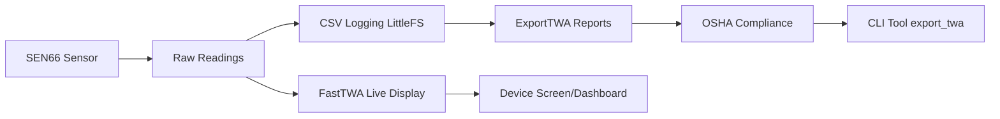

# TWACore Library - Developer Guide

**OSHA-Compliant Time-Weighted Average Calculation Library**

This guide explains the TWACore library for new engineers joining the OSH-Monitor environmental monitoring project.

---

## Table of Contents

- [What is TWA and Why Do We Need It?](#what-is-twa-and-why-do-we-need-it)
- [The Dual-Architecture Approach](#the-dual-architecture-approach)
- [Key Design Patterns](#key-design-patterns)
- [Integration with OSH-Monitor](#integration-with-OSH-Monitor)
- [Critical Implementation Details](#critical-implementation-details)
- [Common Pitfalls](#common-pitfalls-for-new-engineers)
- [Quick Start Guide](#quick-start-for-new-features)

---

## What is TWA and Why Do We Need It?

**Time-Weighted Average (TWA)** is a regulatory calculation required by OSHA for workplace safety. Instead of just looking at peak exposure levels, TWA calculates the average exposure over an 8-hour work period, weighted by time duration. This is crucial for particulate matter, VOCs, noise, radiation, and other environmental hazards.

### Example Calculation

If someone is exposed to:
- 10 µg/m³ PM2.5 for 6 hours  
- 20 µg/m³ PM2.5 for 2 hours

The TWA would be: `(10×6 + 20×2) ÷ 8 = 12.5 µg/m³`

---

## The Dual-Architecture Approach

We solve two different problems with two specialized classes:

### 1. FastTWA - Real-Time Monitoring

- **Purpose**: Live TWA display on device screens/dashboards
- **Method**: Efficient circular buffer with O(1) updates
- **Memory**: RAM-resident for speed
- **Use Case**: "Show me current 8-hour TWA as I collect data"

```cpp
FastTWA fastTWA(60); // 60-second sampling interval
fastTWA.addSample(12.5f); // Add PM2.5 reading
float currentTWA = fastTWA.getCurrentTWA(); // Get live estimate
bool isValid = fastTWA.hasValidTWA(); // Check if 8+ hours of data
```

### 2. ExportTWA - Regulatory Compliance  

- **Purpose**: Official OSHA-compliant reports for regulatory submission
- **Method**: Precise time-weighted calculations from stored CSV data
- **Features**: Gap detection, audit trails, compliance validation
- **Use Case**: "Generate official 8-hour TWA report for OSHA submission"

```cpp
std::vector<String> params = {"pm1_0", "pm2_5", "pm4_0", "pm10"};
ExportTWA exportTWA(60, params, -5); // 60s interval, UTC-5 timezone
TWAExportResult result = exportTWA.calculateFromCSV(csvData);

// Access results
float pm25_twa = result.parameterTWAs["pm2_5"];
bool compliant = result.oshaCompliant; // true if >= 8 hours data
```

---

## Key Design Patterns

### Sensor-Agnostic Architecture

The library uses `std::map<String, float>` and `std::vector<String>` so it works with ANY environmental parameters:

```cpp
// Particulate Matter Monitoring
std::vector<String> pmParams = {"pm1_0", "pm2_5", "pm4_0", "pm10"};

// Noise Monitoring  
std::vector<String> noiseParams = {"soundLevel_dBA"};

// Multi-Gas Detection
std::vector<String> gasParams = {"CO_ppm", "CO2_ppm", "H2S_ppm", "CH4_ppm"};

// Radiation Monitoring
std::vector<String> radParams = {"gamma_uSv_h", "beta_cpm", "alpha_cpm"};
```

### Dynamic CSV Column Mapping

ExportTWA automatically detects CSV structure by scanning headers:

```cpp
bool parseDataPoints(const String& csvData, std::vector<MeasurementSample>& samples) {
    // Scans header row: timestamp,location,project,user,pm1_0,pm2_5,temperature...
    // Builds columnIndex map: {"pm1_0" -> 4, "pm2_5" -> 5, ...}
    // Extracts only the parameters we care about for TWA calculation
}
```

**Benefits:**
- Add metadata columns without breaking TWA calculations
- Reorder CSV columns without code changes
- Support multiple sensor types with different parameter sets

### Template Method Pattern

Override `formatOutput()` for custom export formats:

```cpp
class JSONExportTWA : public ExportTWA {
protected:
    String formatOutput(const TWAExportResult& result) override {
        String json = "{\n";
        json += "  \"compliance\": " + String(result.oshaCompliant ? "true" : "false") + ",\n";
        json += "  \"coverage_hours\": " + String(result.dataCoverageHours, 2) + ",\n";
        json += "  \"twa_values\": {\n";
        
        for (const auto& pair : result.parameterTWAs) {
            json += "    \"" + pair.first + "\": " + String(pair.second, 3) + ",\n";
        }
        
        json += "  }\n}";
        return json;
    }
};
```

---

## Integration with OSH-Monitor

The TWACore library integrates into the main project workflow:



### Workflow Steps

1. **FastTWA** runs continuously, updating every sensor reading for live display
2. **CSV logging** stores all raw data to LittleFS filesystem  
3. **ExportTWA** processes the complete CSV when you need official reports
4. **CLI tool** provides `export_twa` command for regulatory exports

---

## Critical Implementation Details

### Gap Detection Algorithm

```cpp
unsigned long duration = next.timestamp - current.timestamp;
if (duration > _gapThreshold) {  // _gapThreshold = samplingInterval * 2
    gaps++;
}
```

**Purpose:** Detect when data collection was interrupted (sensor offline, device restart, etc.)

### OSHA Compliance Validation

```cpp
result.oshaCompliant = (result.dataCoverageHours >= MIN_OSHA_HOURS); // >= 8.0 hours
```

**Requirements:**
- Minimum 8 hours of continuous data
- Gaps are detected but don't automatically disqualify compliance
- Coverage calculation accounts for total time span, not just sample count

### Time-Weighted Calculation

```cpp
float weightedSum = 0.0f;
unsigned long totalTime = 0;

for (size_t i = 0; i < samples.size() - 1; i++) {
    unsigned long duration = next.timestamp - current.timestamp;
    float value = current.values[paramIndex];
    
    weightedSum += value * duration;  // Weight each sample by time duration
    totalTime += duration;
}

return weightedSum / totalTime;   // True time-weighted average
```

**Key Point:** Each measurement is weighted by how long it lasted, not treated equally.

### Circular Buffer Management (FastTWA)

```cpp
void FastTWA::addSample(float value) {
    if (_bufferFull) {
        // O(1) update: remove old value, add new value
        _sum = _sum - _buffer[_bufferIndex] + value;
        _buffer[_bufferIndex] = value;
        _bufferIndex = (_bufferIndex + 1) % _bufferSize;
    } else {
        // Still filling buffer
        _buffer.push_back(value);
        _sum += value;
        if (_buffer.size() >= _bufferSize) {
            _bufferFull = true;
        }
    }
}
```

**Efficiency:** Maintains O(1) performance even with thousands of samples by using running sum.

---

## Common Pitfalls for New Engineers

### 1. Confusing the Two TWA Classes

❌ **Wrong:**
```cpp
FastTWA calculator(60);
// Later... trying to generate regulatory report
calculator.generateReport(); // FastTWA doesn't have this method!
```

✅ **Correct:**
```cpp
FastTWA fastTWA(60);        // For live display
ExportTWA exportTWA(60, params, utcOffset); // For compliance reports
```

### 2. Parameter Name Mismatches

❌ **Wrong:**
```cpp
std::vector<String> params = {"PM2.5", "pm25"};  // Won't match CSV headers
```

✅ **Correct:**
```cpp
std::vector<String> params = {"pm2_5", "pm2_5"};  // Must match CSV exactly
```

### 3. UTC Offset Confusion

❌ **Wrong:**
```cpp
ExportTWA exportTWA(60, params, 5);  // Positive for Eastern Time (UTC-5)
```

✅ **Correct:**
```cpp
ExportTWA exportTWA(60, params, -5); // Negative for UTC-5 (Eastern Time)
```

### 4. Ignoring Buffer State

❌ **Wrong:**
```cpp
float twa = fastTWA.getCurrentTWA(); // Might be based on < 8 hours of data
displayTWA(twa); // Shows misleading value
```

✅ **Correct:**
```cpp
if (fastTWA.hasValidTWA()) {
    float twa = fastTWA.getCurrentTWA();
    displayTWA(twa);
} else {
    displayMessage("Collecting data... " + String(hoursCollected) + "/8 hours");
}
```

### 5. Gap Threshold Misunderstanding

The gap threshold is **2× sampling interval** to account for minor timing variations:

```cpp
// If sampling every 60 seconds, gaps detected when duration > 120 seconds
// This prevents false positives from slight timing jitter
```

---

## Quick Start for New Features

### Adding TWA Support for New Sensor Types

1. **Define your parameters:**
```cpp
// For a noise monitoring device
std::vector<String> noiseParams = {"sound_dBA", "sound_dBC", "sound_peak"};

// For a gas detection array  
std::vector<String> gasParams = {"CO_ppm", "H2S_ppm", "SO2_ppm", "NO2_ppm"};
```

2. **Create calculators:**
```cpp
FastTWA fastTWA(samplingInterval);
ExportTWA exportTWA(samplingInterval, myParams, utcOffset);
```

3. **Use FastTWA for live display:**
```cpp
// During measurement loop
fastTWA.addSample(sensorReading);

// For display updates
if (fastTWA.hasValidTWA()) {
    float liveTWA = fastTWA.getCurrentTWA();
    updateDisplay("8hr TWA: " + String(liveTWA, 2) + " dBA");
}
```

4. **Use ExportTWA for compliance reports:**
```cpp
// When user requests official report
String csvData = readCompleteCSVFile();
TWAExportResult report = exportTWA.calculateFromCSV(csvData);

if (report.oshaCompliant) {
    Serial.println("✓ OSHA Compliant: " + String(report.dataCoverageHours) + " hours");
    for (const auto& pair : report.parameterTWAs) {
        Serial.println(pair.first + " 8-hr TWA: " + String(pair.second) + " dBA");
    }
} else {
    Serial.println("✗ Insufficient data for OSHA compliance");
}
```

### Custom Export Formats

```cpp
class DatabaseExportTWA : public ExportTWA {
protected:
    String formatOutput(const TWAExportResult& result) override {
        // Generate SQL INSERT statements
        String sql = "INSERT INTO twa_reports (timestamp, compliant, coverage_hours, ";
        for (const auto& pair : result.parameterTWAs) {
            sql += pair.first + "_twa, ";
        }
        sql += ") VALUES (NOW(), " + String(result.oshaCompliant) + ", ";
        sql += String(result.dataCoverageHours) + ", ";
        for (const auto& pair : result.parameterTWAs) {
            sql += String(pair.second) + ", ";
        }
        sql += ");";
        return sql;
    }
};
```

---

## Architecture Summary

The TWACore library's beauty lies in its **separation of concerns**:

- **FastTWA**: Optimized for real-time performance and memory efficiency
- **ExportTWA**: Optimized for regulatory accuracy and comprehensive reporting
- **Sensor-agnostic design**: Works with any environmental parameter
- **Flexible output**: Template Method pattern supports any export format

Whether you're monitoring air quality, noise levels, radiation, or gas concentrations, the TWA mathematics and OSHA compliance logic remains identical—just swap the parameter names and units.

This design enables the OSH-Monitor project to scale from simple particulate monitoring to comprehensive multi-parameter environmental compliance systems.